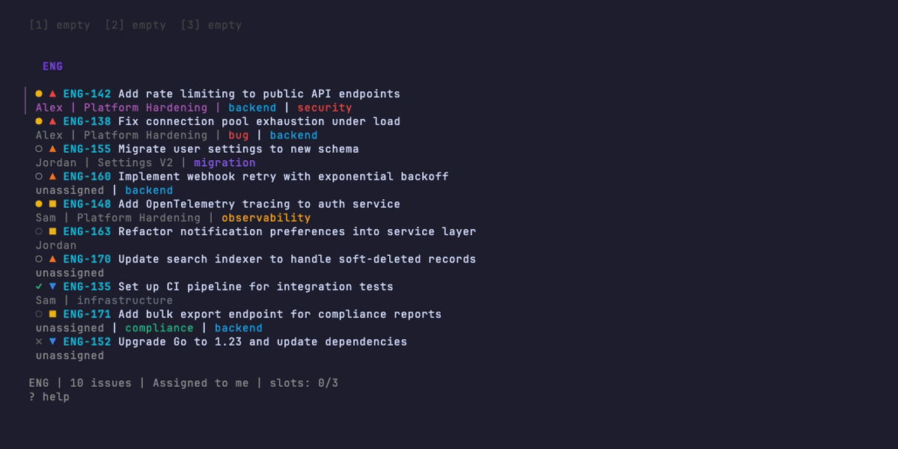

# linear-worktree

A terminal UI for browsing Linear issues and launching git worktrees with Claude Code sessions.

Built with [Bubble Tea](https://github.com/charmbracelet/bubbletea), [Bubbles](https://github.com/charmbracelet/bubbles), and [Lip Gloss](https://github.com/charmbracelet/lipgloss).



## Features

- **Issue browsing** with status icons, priority indicators, labels, and fuzzy search
- **Detail panel** showing full descriptions and comments with Markdown rendering
- **Worktree creation** from any issue -- auto-creates branch, copies config files
- **Claude Code sessions** launched directly into worktrees with custom prompts
- **E-layout** -- TUI on the left, up to 4 stacked Claude sessions on the right
- **Live agent status** -- see which sessions are running, idle, or waiting for input
- **Multi-team support** -- switch between Linear teams with number keys
- **Comments** -- post comments to Linear directly from the TUI
- **Assign/unassign** -- manage issue ownership without leaving the terminal
- **Project filtering** -- scope the issue list to specific projects
- **Server-side search** -- find issues across the entire team


## Install

```bash
go install github.com/serabi/linear-worktree@latest
```

Or build from source:

```bash
git clone https://github.com/serabi/linear-worktree.git
cd linear-worktree
go build -o linear-worktree .
```

## Quick Start

```bash
./linear-worktree
```

On first run, you'll be prompted for your Linear API key and team. Your API key is stored in the OS keychain (macOS Keychain / Linux Secret Service), not in a config file.

To try the TUI without a Linear account:

```bash
./linear-worktree --demo
```

## E-Layout

When running inside [cmux](https://github.com/sarahwolff/cmux), linear-worktree manages an E-shaped terminal layout:

```
+------------+------------------------+
|            |  worktree 1 (claude)   |
|            +------------------------+
|  TUI       |  worktree 2 (claude)   |
|  (this)    +------------------------+
|            |  worktree 3 (claude)   |
+------------+------------------------+
```

- **Left third**: the TUI, always visible
- **Right two-thirds**: up to 4 stacked Claude Code sessions
- Each slot shows live status: running, idle, or waiting for input
- Closing a slot auto-expands the remaining ones

Without cmux, falls back to launching tmux sessions.

## Keybindings

### Navigation

| Key | Action |
|-----|--------|
| `j`/`k` or `Up`/`Down` | Navigate issues |
| `/` | Fuzzy filter issue list |
| `S` | Server-side search |
| `Tab` | Cycle filter: Assigned > All > Todo > In Progress > Unassigned |
| `f` | Open filter picker |
| `p` | Filter by project |
| `1`-`9` | Switch teams |

### Actions

| Key | Action |
|-----|--------|
| `c` | Launch Claude Code in worktree (opens menu) |
| `w` | Create worktree only |
| `x` | Close worktree slot |
| `a` | Assign issue to me |
| `A` | Unassign issue |
| `m` | Post comment |
| `g` | Open issue in browser |
| `l` | Open links from description |

### Views

| Key | Action |
|-----|--------|
| `d` / `Enter` | Toggle detail panel |
| `r` | Refresh issues |
| `s` | Settings |
| `?` | Toggle help |
| `q` | Quit |

## Configuration

Stored at `~/.config/linear-worktree/config.json`:

```json
{
  "teams": [
    {"id": "...", "key": "MYTEAM"}
  ],
  "worktree_base_dir": "../worktrees",
  "copy_files": [".env", ".envrc"],
  "copy_dirs": [".claude"],
  "claude_command": "claude",
  "claude_args": "",
  "branch_prefix": "feature/",
  "max_slots": 3,
  "post_create_hook": "",
  "prompt_template": ""
}
```

### Credential Storage

Your Linear API key is stored in the **OS keychain** (macOS Keychain / Linux Secret Service). On first setup, the key is written to the keychain automatically.

If you have an existing config with a plaintext `linear_api_key`, it will be migrated to the keychain on the next run.

**Fallback**: Set `LINEAR_API_KEY` as an environment variable for headless servers or CI.

### Debug Mode

```bash
LWT_DEBUG=1 ./linear-worktree
```
